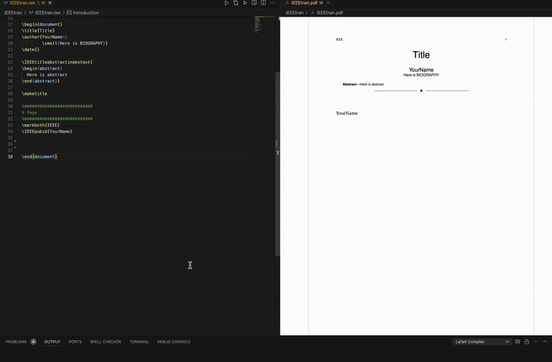
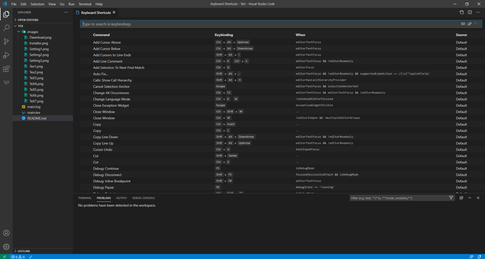

# LaTeX-VSCode-template

Optimize your LaTeX environment with **VSCode** for seamless report and paper creation.



## Installation

> [!NOTE] Make sure to have vscode as well.

```bash
# For Windows
install-tl-windows.exe
# For Mac
brew install mactex-no-gui --cask
# For Linux
sudo apt install texlive-full
```

## VSCode Extension

-   [ ] LaTeX Workshop

### Set up `.latexmkrc` file (Optional)

The `.latexmkrc` file configures **latexmk**, an automatic build tool that streamlines the LaTeX compilation process.

```perl
$latex = 'platex -synctex=1 -halt-on-error -file-line-error %O %S';
$dvipdf = 'dvipdfmx %O -o %D %S';
$pdf_mode = 3;
$pvc_view_file_via_temporary = 0;
$max_repeat = 5;
```

## Registering snippet

VSCode snippets allow quick insertion of LaTeX templates.

```json
{
	"report": {
		"prefix": "report",
		"body": [
			"\\documentclass[a4paper,11pt]{article}",
			"\\usepackage{amsmath,graphicx}",
			"\\begin{document}",
			"\\title{${1:Title}}",
			"\\author{${2:Author}}",
			"\\date{${3:\\today}}",
			"\\maketitle",
			"$0",
			"\\end{document}"
		],
		"description": "Basic LaTeX report template"
	}
}
```

## Assign shortcut

Press **Ctrl + K → Ctrl + S** (Windows) or **⌘ + K → ⌘ + S** (Mac). In the search bar, type **"build with recipe"** and assign a shortcut.


